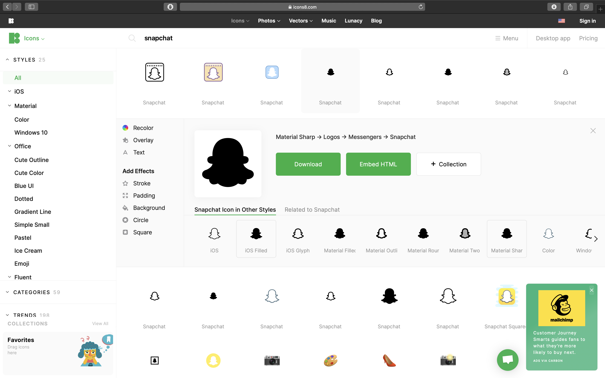
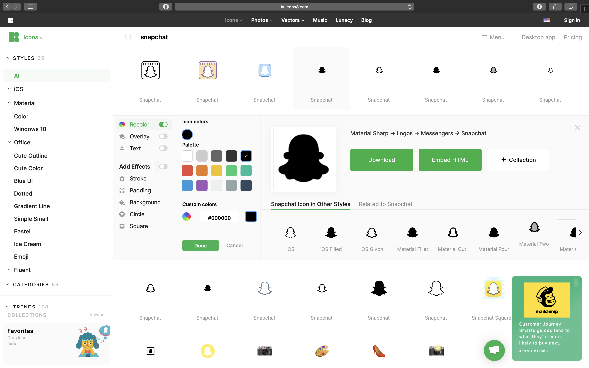
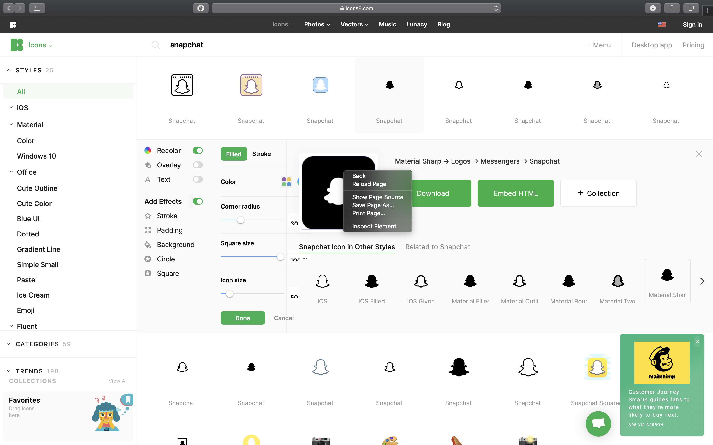
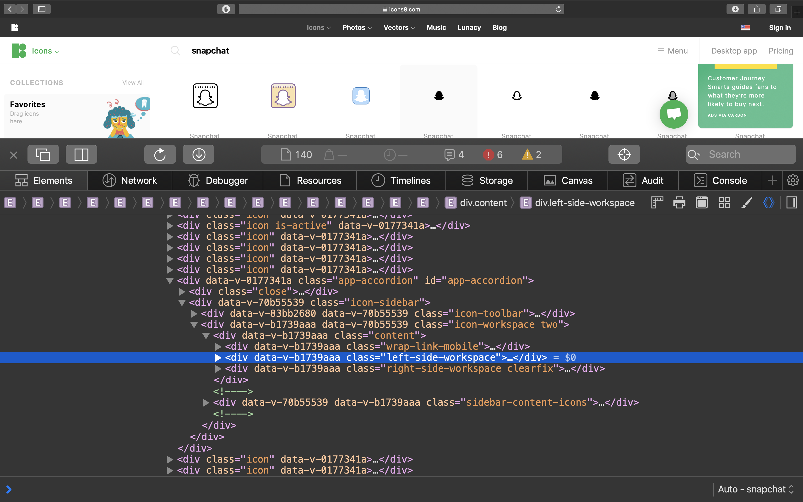
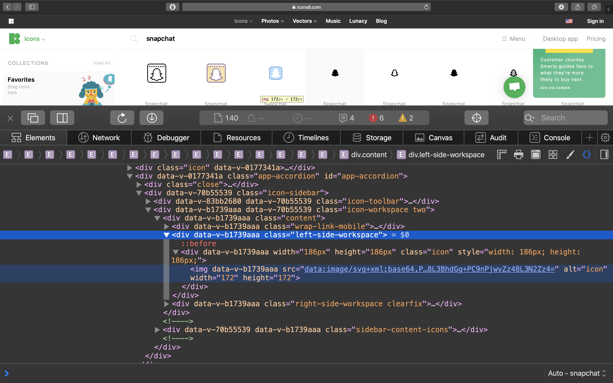
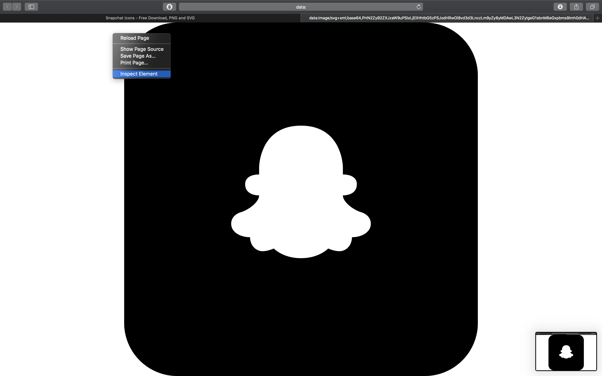
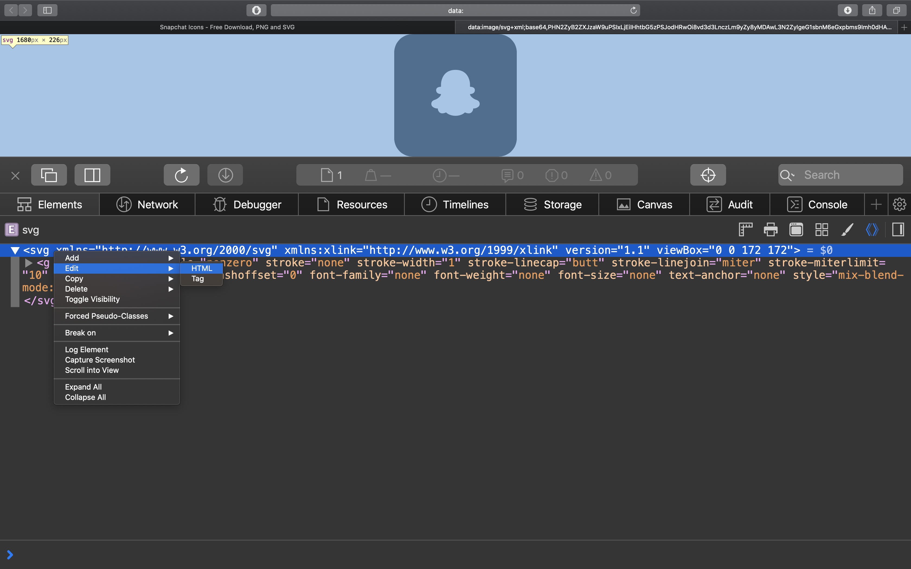
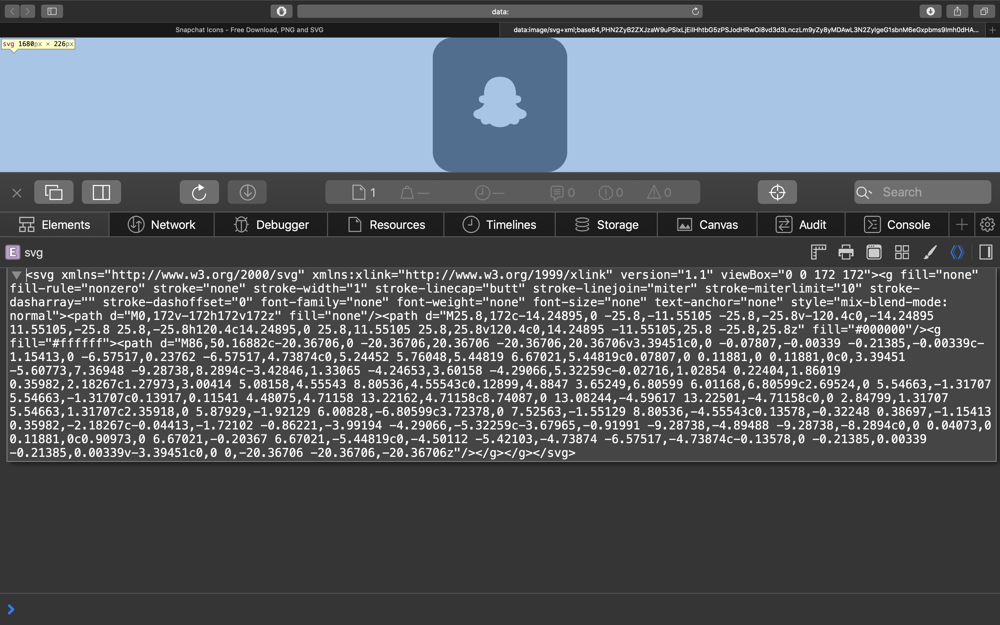
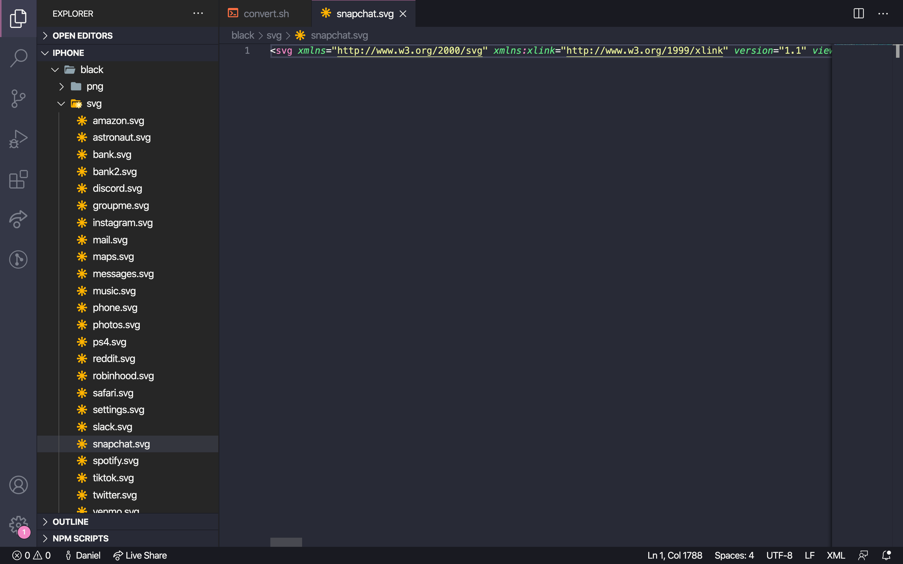

# iPhone Icons

## Current Themes

* Black
* Mint
* Navy

## Contributing

If you add new icons for any of the existing themes please make a PR so everyone can enjoy :smile: 


## How To


### Step 1

Go to [icons8.com](icons8.com) and find an icon you'd like to create a shortcut with.



### Step 2

If you's like you can add a color for the main icon using the recolor option.



### Step 3

Once all the desired effects have been applied right click on the icon and select "Inspect Element"

 

### Step 4

Once the element is in focus click on the right arrow at the start of the line to expand the div element.



### Step 5

Once opened again expand the inner div to reveal the `` tag. Once revealed open the source link for the image in a new tab



### Step 6

Once in the new tab right click anywhere and select "inspect element"



### Step 7

Once opened right click on the root svg element and select edit > html.



### Step 8

Now just copy all the contents.



### Step 9

Finally save the contents into a svg file.

**Don't put spaces in the svg file names**




## Converting from svg to png

Now that we have our collection of svgs we can easily convert them to pngs. I have written a script to preform this and have setup a docker enviorment to facilitate the conversion. To preform the conversion run the convert script like so:

```bash
./convert.sh png ./path/to/svgs ./output/dir/for/pngs
```
